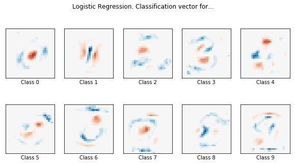
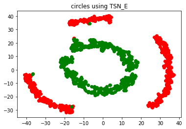
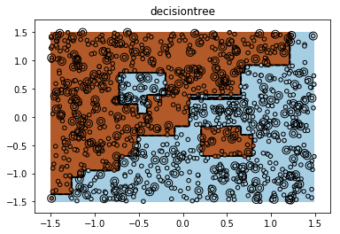
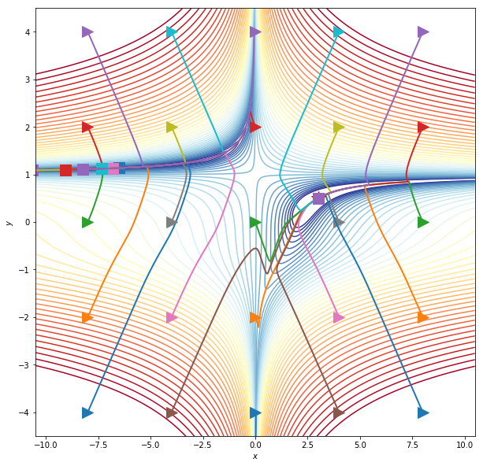

# Machine Learning in Fundamental Physics 2019

My solutions for the ML in Fundamental Physics course by Dr. Sven Krippendorf @ LMU Munich, Summer Term 2019  

Link to the lecture:  
https://www.physik.uni-muenchen.de/lehre/vorlesungen/sose_20/ML_in_Fundamental_Physics/index.html  

  

Problem sets and sample solutions may be obtained from Dr. Sven Krippendorf:  
 - https://krippendorflab.github.io/
- sven.krippendorf@physik.uni-muenchen.de  

Commented and corrected solutions with tutor feedback are labeled with "_corr".  

Final Grade: 1.3

 

